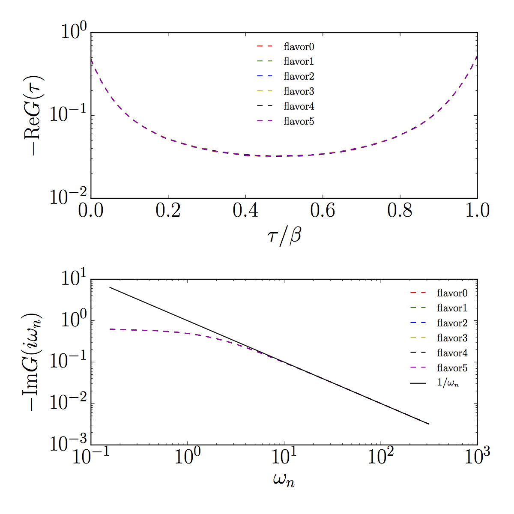

# List of tutorials
- [Tutorial1](#tutorial1)

## Tutorial1
We explain how to solve a three-orbital model with spin-orbit coupling and Slater-Kanamori interaction.
The DOS of the bath is a semicircular of the width 4.
The hybridization function is diagonal in flavor.

The spin-orbit coupling is 1.
The matrix representation of the spin-orbit coupling is taken from Eq. (7) of Eur. Phys. J. B 86 (94) (2013).
We take U=1 and J=0.25 (U'=U-2J) for the Slater-Kanamori interaction.
The inverse temperature is 20.

Python scripts for generating input files and analyzing the result are available [here](https://github.com/ALPSCore/CT-HYB/tree/master/tutorials/tutorial1).
Checkout the files and provide something like the following:
```
$python gen_Uijkl.py                       #generate Coulomb matrix
$python gen_hyb.py                         #generate hybridization function
$python gen_hopping.py                     #generate hopping matrix
$mpirun -np 60 /path/to/hybmat input.ini   #run the solver with 60 MPI processes
$python plot.py                            #plot Green's function
```
If you want to use the non-MPI version, just do like this
```
$ /path/to/hybmat input.ini
```

At the end of the simulation, the results are written into the HDF5 file "input.out.h5".
A HDF5 file can be read easily e.g. by using the h5py library in Python.
In the script file "plot.py", one reads out the Green's function from the output file,
plot the data, and save the plot as a PDF file.
The graph looks like this (simulation time was 10min with 60 MPI processes).


